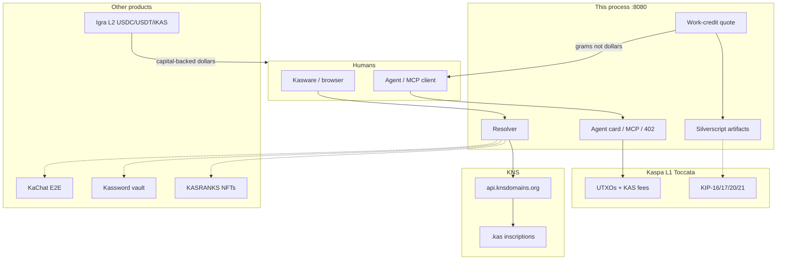

# Superapp diff map

How to read the **Status** column (same discipline as kaspaexplained / `/honest`):

| Tag | Meaning |
| --- | --- |
| **live** | Mainnet. You can re-derive it. |
| **indexer** | True if you trust the named indexer. |
| **local** | This process only (`kns.exe`). |
| **compiled** | Silverscript artifact exists. Not deployed. |
| **roadmap** | Designed. Consensus may be ready. App is not. |
| **research** | Paper / KIP / simulator. Not a product. |
| **external** | A real other product. We link, we do not impersonate. |
| **wrong** | Sounds right. Contradicts the spec. Do not ship it. |

---

## Layer cake

Dashed lines are **pointers**, not implementations.

## Two L1 dApps (this pass)

| dApp | Folder | Port | Unit | L2 | What it is |
| --- | --- | --- | --- | --- | --- |
| **Gramlane** | `Documents\kaspa\superapp` | `:8081` | GRAM (KIP-21 grams) | **none** | Work-credit alternative. Sequenced jobs. Possible today. Not a dollar. |
| **Kaspa Till** | `Documents\kaspa\superappstablesalternative` | `:8082` | reserved `kUSD` | **none** | Merchant whose shelf is already in a future L1 stable. Settle in KAS now. No grams. |

L2 (Igra, bridges, wrapped USDC) is out of scope for both.

---

## Identity — names

| Surface | What it is | Status | This repo |
| --- | --- | --- | --- |
| `app.knsdomains.org` | Official inscriber | **live / indexer** | Linked. We do not broadcast. |
| Envelope `kns` create/transfer | Inscription protocol | **live** | `/register` builds JSON, does not send |
| `api.knsdomains.org/mainnet` | Owner, profile, primary, assets | **indexer** | `internal/knsapi` |
| `name.kas.limo` | Redirect gateway | **indexer** | Record key only |
| Pay URI `kaspa:<addr>?label=` | Wallet can pay a name | **indexer** | `/name/{n}` |
| Reverse lookup | Primary name of an address | **indexer** | `/api/v1/reverse` |
| Directory | Names of an owner | **indexer** | `/directory` |
| Covenant domain “name = UTXO” | Registrar-issued singleton | **roadmap** | `KasName.sil` **compiled**, not deployed |
| `sha256(name)` as `covenant_id` | — | **wrong** | Removed. KIP-20 ids are outpoint hashes |
| Global uniqueness on L1 | Script asks “is alice taken?” | **wrong** | UTXO set has no name index |
| Subnames `pay.shop.kas` | Parent-issued children | **roadmap** | Design; inscription create is one label |
| Based ZK name set / lane `KNS1` | Off-chain SMT + proof | **research** | `/sim` is a toy map |
| `kas://` `did:kas:` | URI / DID convention | **local** | `internal/protocol` |
| vProgs guest names | Atomic compose | **research** | Socket in era 4 |

---

## Agents — Web4.0

| Surface | What it is | Status | This repo |
| --- | --- | --- | --- |
| HTML site | Generated from records | **local + indexer** | `/site/{name}` |
| `Accept: application/json` | Same object as data | **local** | site + cards |
| ERC-8004 **file shape** | Agent registration JSON | **local** | `/agent/{name}.json` |
| Kaspa ERC-8004 registry | On-chain agent NFT | **wrong** (does not exist) | We do not fake one |
| MCP `POST /mcp` | `resolve_kas` `agent_card` `pay_kas` `kachat_contact` `kas_rank` `quote_work` | **local** | `internal/server/web4.go` |
| A2A card | Agent-to-agent shape | **local** | `/.well-known/agent-card.json` |
| HTTP 402 | Pay-to-call | **local** | `/api/v1/call/{name}` |
| Coinbase x402 / USDC | EVM 402 rail | **wrong** to claim | Kaspa 402, KAS or grams |
| `X-Kaspa-Payment` | Receipt header | **local** | Not verified on-chain |
| `/llms.txt` `/ai.txt` | Agent hints | **local** | static |

---

## Social / secrets / rank / conventions

| Surface | What it is | Status | This repo |
| --- | --- | --- | --- |
| KaChat `ciph_msg:1:` / `kchat:1:` | E2E chat on Kaspa | **external** | Contact from name. We do not encrypt |
| KaPosts / groups | KaChat 4.0 social | **external** | `/kaposts` is a **local** board |
| Kassword | Browser PQ vault, no server | **external** | `/kassword` pointer + `vaultCommit` convention |
| kaspa-data-vault | AES-GCM + 5-min window | **external / research** | Commitment only. Bytes not on chain |
| KasRanks ocean bags | Live balance → Shrimp… | **local** | `/ranks` via `api.kaspa.org` |
| KASRANKS NFT (782) | Separate collection | **external** | We do not look it up |
| KCC-0/1/2/20 | Draft conventions | **external drafts** | `/kcc` lists them |
| KCC-KNS-Web4 | Agent record idea | **local** | `conventions/kcc-kns-web4.md` |
| KCC-Work-Credits | Gram voucher idea | **local** | `conventions/kcc-work-credits.md` |

---

## Covenants — Silverscript v1-rc1

Official compiler: kaspanet `v1-rc1` (30 Aug 2026, @OriNewman). RC ≠ tagged `v1`. Windows `silverc.exe` SHA256 `fbf75851e8d1c97e1982e72cb26e8b8f6417fa5a6ed99d58693d6314890619c3`. Clone: `C:\Users\Remco\silverscript` @ `c7d17a1`.

| Contract | Role | Status |
| --- | --- | --- |
| `contracts/v1/KasName.sil` | Owner + labelHash + kasPkh + vaultCommit | **compiled** template_hash `e7f981d9…32b79f` |
| `contracts/v1/KaChatPayTimeout.sil` | Recipient now / sender after timeout | **compiled** |
| `contracts/v1/WorkCredit.sil` | Prepaid grams: mint / consume / transfer | **compiled** template_hash `c61458da…11521e` |
| `KasRegistrar.sil` `CovenantDomain.sil` `NameSet.sil` `NameVault.sil` | Old sugar (`#[covenant.singleton]`) | **sketch** — does not compile on v1-rc1 |

`/silverc` and `GET /api/v1/artifact/{KasName,KaChatPayTimeout,WorkCredit}`.

---

## Money and fees (the stables question)

| Rail | Unit | Backing | Status | Use it for |
| --- | --- | --- | --- | --- |
| KAS L1 | sompi | Native issuance | **live** | Settlement, miner fees |
| Min-relay policy | 100 sompi / gram | Policy, not consensus | **live** | Default quote rate |
| KIP-21 lanes | 50 lanes/block, 1e9 gas/lane | Consensus (Toccata) | **live consensus; apps thin** | Named-lane work |
| **Work Credit** | 1 credit = 1 gram | Covenant ledger + issuer inventory | **compiled + local quote** | dApp opex / agent 402 |
| User FeeGrant (own KAS locked) | KAS | User’s own capital | **research** (not compiled) | Trust-minimized prepaid fees |
| Igra iKAS | wrapped KAS | Lock KAS, mint iKAS | **external live** | L2 gas |
| Igra USDC / USDT | USD | Circle/Tether + Hyperlane bridge | **external live** | Actual dollars |
| Native Kaspa USD stable | $1 | Would need reserves or an oracle | **wrong / not soon** | Do not invent one here |
| Algorithmic kas-USD (UST-like) | $1 from a rebase | A story | **wrong** | Death spiral |

**Diff vs “stables on other chains”:** Ethereum/Solana dApps invoice in USDC because a capitalized issuer exists. Kaspa L1 has no such issuer. This stack does **not** take an L2 shortcut. Gramlane invoices **grams**. Kaspa Till reserves **kUSD** for when an L1 issuer/vault exists.

---

## Sequencing / L2 / future

| Surface | What it is | Status |
| --- | --- | --- |
| Toccata | 30 Jun 2026, DAA `474_165_565`, KIPs 16/17/20/21 Active | **live** |
| rusty-kaspa v2.0.1 | Node that activated Toccata | **live** |
| Igra | EVM L2 sequenced on Kaspa; Hyperlane USDC/iKAS/cbBTC/wstETH | **external live** |
| Kaskad etc. | Igra DeFi using those assets | **external** |
| vProgs | Based ZK apps | **research** — no public testnet |
| DAGKnight (KIP-2) | Ordering | **research** — Proposed |
| 100 BPS 2027 | Throughput target | **research** — no spec |
| This app broadcasting Toccata txs | — | **wrong** |

---

## HTTP map (`kns.exe`)

| Path | Role | Status |
| --- | --- | --- |
| `/` `/app` `/name/` `/me` `/directory` | Resolve | indexer + local |
| `/site/` `/web4` `/4` `/agent/` `/mcp` `/api/v1/call/` | Web4.0 | local |
| `/kachat` `/kassword` `/ranks` `/kcc` `/kaposts` | Ecosystem pointers | mixed |
| `/credits` `/api/v1/credits/quote` | Gram invoices | local |
| `/silverc` `/api/v1/artifact/` | Compiled scripts | compiled |
| `/register` `/covenant` `/honest` `/sim` `/sdk` `/docs` | Protocol / claims | local |
| `/api/health` `/llms.txt` | Machine index | local |

---

## What this superapp will not become

- A USDC clone on L1 “backed by covenants”
- A KaChat clone that pretends to E2E
- A Kassword server that holds secrets
- A KASRANKS marketplace
- A deployed `.kas` registrar (until a real singleton UTXO exists)
- A vProg

Those would be delusion, not vision.
